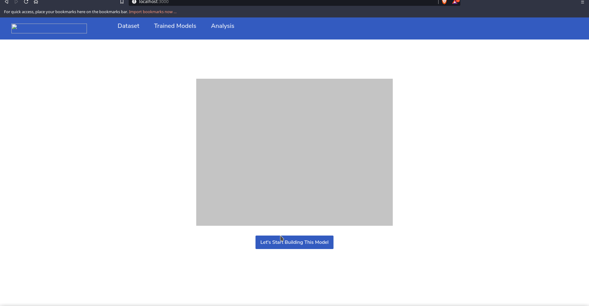
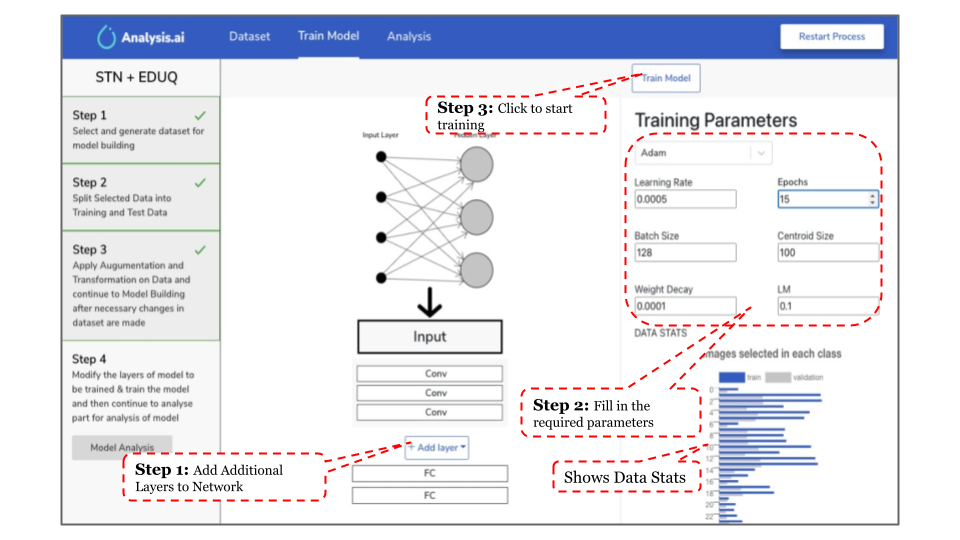
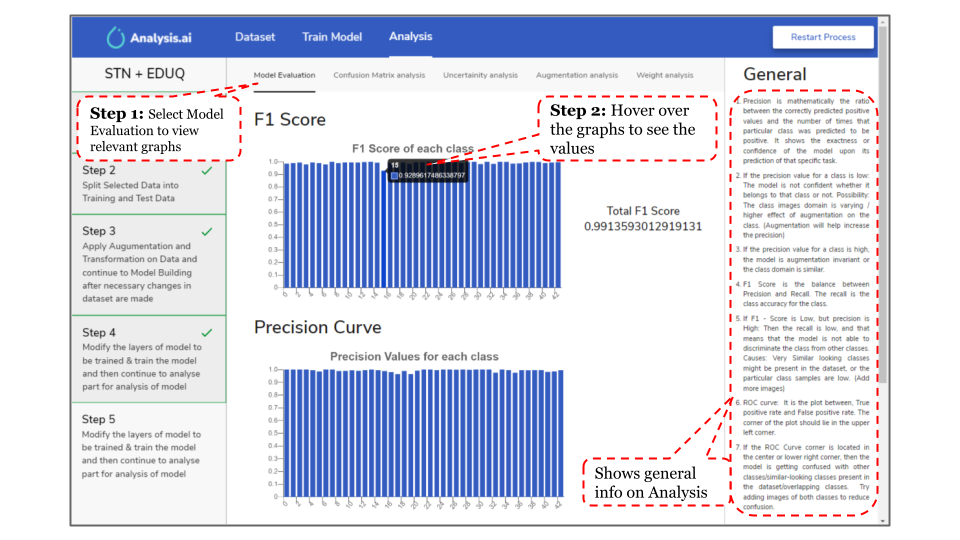
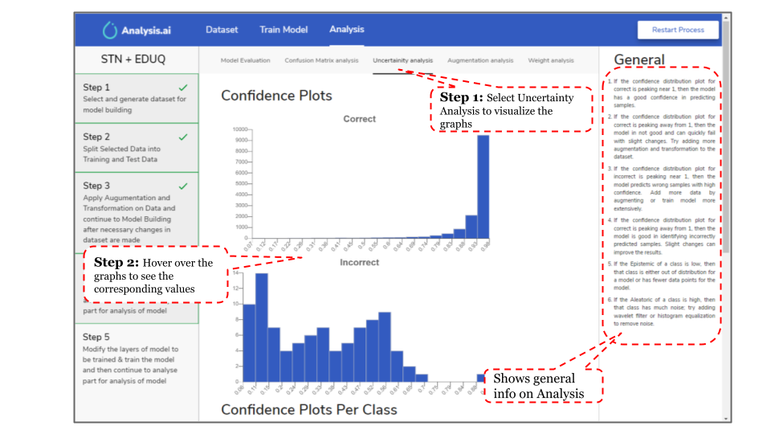
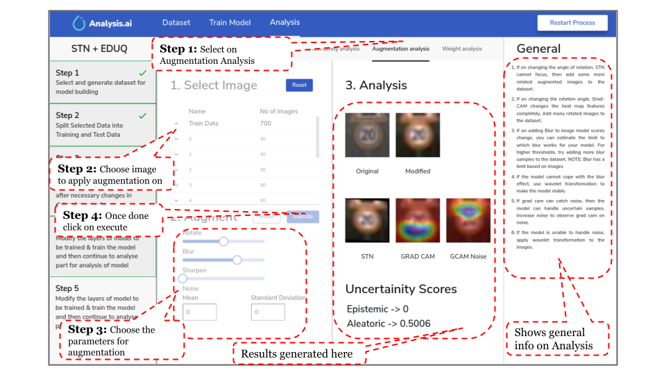
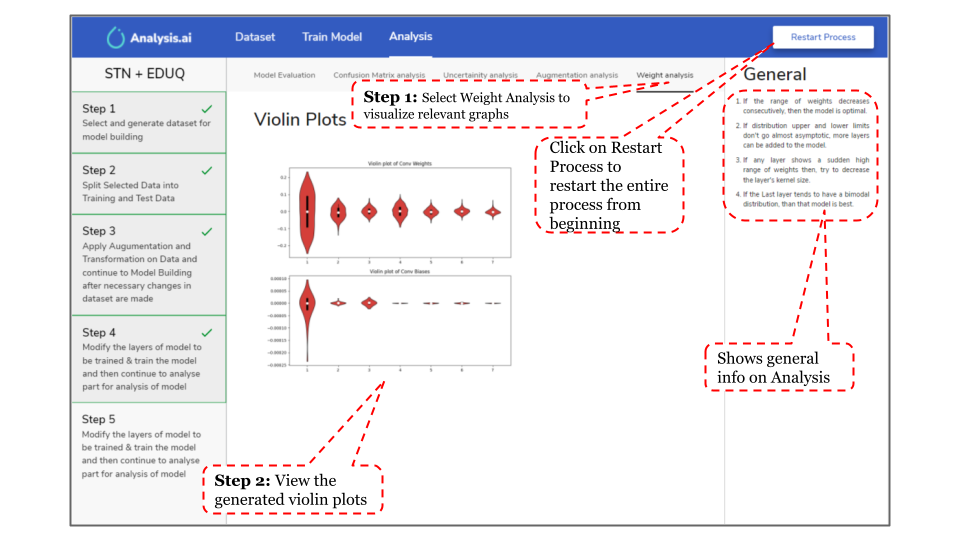

# BOSCH's TRAFFIC SIGN RECOGNITION



With the advancements in AI and the development of computing capabilities in the 21st century, millions of processes around the globe are being automated like never before. The automobile industry is transforming,and the day isn't far when fully autonomous vehicles would make transportation extremely inexpensive andeffective. But to reach this ambitious goal, which aims to change the very foundations of transportation as anindustry, we need to first solve a few challenging problems which will help a vehicle make decisions by itself.
This is one such problem and solving it would take us one step closer to L5 autonomy.

The developed software package **“Analysis.ai”** is designed to help an analyst to build datasets for traffic sign recognition, implement wide variety of augmentation and transformation techniques on the dataset with wide flexibility. Furthermore, the package provides user with a latest deep learning model E-DUQ clubbed with an Spatial Transformer Network (STN) to not only make a prediction but also give information regarding noise and confidence level of the prediction. The detailed analysis of the trained model has been done using uncertainty, architecture and augmentative analysis. 

## Setup

Make sure you have the latest version of python and pip3 installed.

If you are an ubuntu user run:
```bash
sudo apt-get update
sudo apt-get install -y libgl1-mesa-dev python3-distutils
```

Run the commands(for all OS users):
```bash
clone the repo and cd into it
pip3 install pipenv
pipenv install
pipenv run api
```

## DataSet Description

### German Traffic Sign Recognition(GTSR) Dataset
The German Traffic Sign Benchmark is a multi-class, single-image classification challenge held at the International Joint Conference on Neural Networks (IJCNN) 2011. The dataset consists of 43 classes as shown in samples below.


### Additional New Classes
The additional 5 new classes are taken from the source: https://www.kaggle.com/aadilmalik94/trafficsigns.

The samples from the same are shown below.

    
## Augmentation & Transformation 
### Augmentation Features
|      Augmentation     |         Function        |                                                Description                                               | Parameters (apart from image) along with default values |
|:---------------------:|:-----------------------:|:--------------------------------------------------------------------------------------------------------:|:-------------------------------------------------------:|
|        Rotation       |         rotate()        |                          Rotates the image about its center by the given angle.                          |                       1. angle = 0                      |
|      Average Blur     |      average_blur()     | Blurs the image based on the kernel dimension.  The more the kernel dimension, the more the blur amount. |          1. kdim=8 (Kernel Dimension) : 1 to 32         |
|     Gaussian Noise    |     gaussian_noise()    |                     Adds gaussian noise with specified mean and variance to the image                    |          1. mean=0 (Mean)  2. var=10 (Variance)         |
|    Image Sharpening   |        sharpen()        |                   Uses unsharp mask to sharpen the image according to the given amount                   |              1. amount=1.0 (Sharpen Amount)             |
|    Horizontal Flip    |    horizontal_flip()    |                                     Flips the image about the Y-axis                                     |                          -----                          |
|     Vertical Flip     |     vertical_flip()     |                                     Flips the image about the X-axis                                     |                          -----                          |
| Prespective Transform | perspective_transform() |                                    Four Point Image prespective change                                   |     1. input_pts = numpy array with the four points     |
|       Image Crop      |          crop()         |                                              Crops the image                                             |     1. input_pts = numpy array with the four points     |
|     Random Erasing    |     random_erasing()    |               Blackens/random fills a rectangular patch on the image specified by the user               |       1. region = numpy array with the four points      |

### Transformation Features

|                  Transformation                  |             Function            |                                                   Description                                                   |                    Parameters (apart from image) along with default values                   |
|:------------------------------------------------:|:-------------------------------:|:---------------------------------------------------------------------------------------------------------------:|:--------------------------------------------------------------------------------------------:|
|              Histogram Equalization              |            Hist_Eq()            |                 A method in image processing of contrast adjustment using the image's histogram                 |                                             -----                                            |
| Contrast Limited Adaptive Histogram Equalization |             CLAHE()             |    A variant of Adaptive histogram equalization (AHE) which takes care of over-amplification of the contrast    | 1. clip_limit=2.0 (clipping Limit for CLAHE)   2. title_grid_size=(8,8) (Grid Size for tile) |
|            Generate Grey Scale Images            |              Grey()             |                                           Converts image to grey scale                                          |                                             -----                                            |
|             Generate RGB scale Images            |              RGB()              |                                           Converts image to RGB scale                                           |                                             -----                                            |
|             Generate HSV scale Images            |              HSV()              |                                           Converts image to HSV scale                                           |                                             -----                                            |
|             Generate LAB scale Images            |              LAB()              |                                           Converts image to LAB scale                                           |                                             -----                                            |
|            Haar Wavelet Transformation           |  Discrete_Wavelet(mode='haar')  | Haar wavelet is a sequence of rescaled "square-shaped" functions which together form a wavelet family or basis. |                1. level=4 (Number of levels to apply  wavelet transformation)                |
|         Daubechies Wavelet Transformation        |  Discrete_Wavelet(mode='db10')  |       Daubechies Wavelet is characterized by a maximal number of vanishing moments for some given support.      |                1. level=4 (Number of levels to apply  wavelet transformation)                |
|          Symlets Wavelet Transformation          |  Discrete_Wavelet(mode='sym10') |              Symlets Wavelet is a modified version of Daubechies wavelets with increased symmetry.              |                1. level=4 (Number of levels to apply  wavelet transformation)                |
|          Coiflets Wavelet Transformation         | Discrete_Wavelet(mode='coif10') |         Coiflets are Wavelets with scaling functions with vanishing moments for discrete transformation.        |                1. level=4 (Number of levels to apply  wavelet transformation)                |
|                 Brightness Change                |         add_brightness()        |                                             Add Brightness to Image                                             |                                             -----                                            |
|                   Shadow Effect                  |           add_shadow()          |                                               Add Shadow to Image                                               |                             1. no_of_shadows=3 (Number of shadow)                            |
|                    Snow Effect                   |            add_snow()           |                                             Add Snow Effect to Image                                            |                                             -----                                            |
|                    Rain Effect                   |            add_rain()           |                                             Add Rain Effect to Image                                            |                                             -----                                            |
|                    Fog Effect                    |            add_fog()            |                                             Add Fog Effect to Image                                             |                                             -----                                            |

## Deep Learning Model

### STN Model
Spatial transformer networks are a generalization of differentiable attention to any spatial transformation. Spatial transformer networks (STN for short) allow a neural network to learn how to perform spatial transformations on the input image in order to enhance the geometric invariance of the model. For example, it can crop a region of interest, scale and correct the orientation of an image. It can be a useful mechanism because CNNs are not invariant to rotation and scale and more general affine transformations.
### E-DUQ
Recently Gal et. al. ICML 2020 presented how a deterministic feed forward model can efficiently determine uncertainty using a RBF network based architecture and gradient penalty loss. 
This model is called DUQ which predicts a “K” value between 0-1 for each class, 0 being completely uncertain and 1 completely certain, incase of an OoD sample DUQ can output 0 for all of the classes. K value is computed by the distance of a class specific feature vector from the corresponding centroid vector of that class in a kernel space.
 In addition to DUQ we make model output noise as done by Gal et. al. NeurIPS 2016 to attenuate loss from erroneous labels and input features. We do this by predicting σ (length scale) along with features. We expect this σ to capture noise present in the sample. This simple extension to DUQ, we name it as E-DUQ, is able to perform well in terms of f1 score of classification as well provides analysis for noise in samples which is another crucial aspect for an intelligent driving system
 


## Model Analysis

The model analysis has been done to assist the analyst in finding problems in the model or dataset used.  The basic analysis can be divided into 4 basic sections: Evaluation, Uncertainty, Augmentative and Network Analysis. 

### Evaluation Analysis
The evaluation analysis has been done using various techniques including F1 Score, Precision, ROC curves, and confusion matrix. 


### Uncertainty Analysis

In general for an intelligent system there can be two types of unknowns, known unknowns and unknown unknowns technically we call them aleatoric and epistemic uncertainty respectively. Aleatoric uncertainty is the inherent ambiguity or noise present in the input whereas epistemic uncertainty is the lack of knowledge for our model i.e. if our model was never shown data points in  certain region of space (OoD) then it becomes region of epistemic uncertainty for the model.


### Augmentative Analysis

The augmentative analysis feature allows users to analyze the effect of various augmentations on the model. The User can select images from the dataset and then further set any augmentation from rotation, blur, sharpen, and noise. Users can see the effect of these on the image in-form of a modified image. The STN focuses on the image and Grad-CAM is also shown on the image. Additionally, we also show Grad-CAM with noise on the image that helps the user to see sections of the image that are responsible for noise in the image. 


### Network Analysis

Network analysis is used to analyze the architecture efficiency of deep learning models. The distribution of weights and bias of each convolution layer are plotted. If the range of weights decreases consecutively, then the model is optimal. If distribution upper and lower limits don’t go almost asymptotic, more layers can be added to the model. A layer showing a sudden high range of weights causes problems in feature extraction, then try to decrease the layer’s kernel size. If the Last layer tends to have a bimodal distribution, then that model is best.


